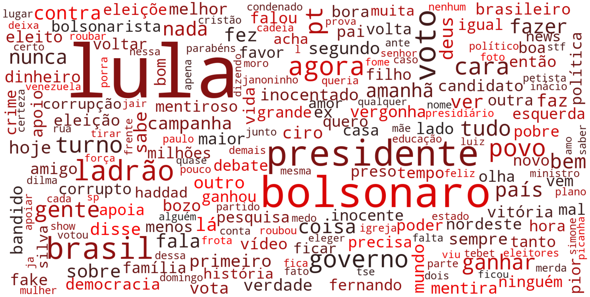
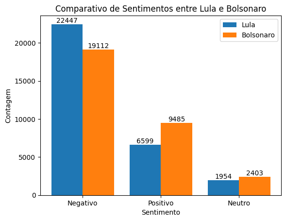

# **POLARIS - Classificador de Polaridade**  

POLARIS é um projeto de análise de polaridade textual focado na classificação de tweets e outras frases em português. Utiliza um modelo **Naive Bayes** treinado com dados de diversas fontes para identificar se um texto possui polaridade **positiva, negativa ou neutra**.  

## **Contexto e Caso de Estudo**  
Este projeto foi desenvolvido com um caso de estudo baseado nas eleições presidenciais de 2022 no Brasil, um período marcado por intensa polarização e grande engajamento popular nas redes sociais.  

> **Importante:** Este projeto tem caráter puramente analítico e educativo, **sem qualquer intenção de favorecer ou prejudicar qualquer candidato ou posicionamento político**. O tema foi escolhido por sua relevância e impacto, sendo um excelente caso para estudo de polaridade textual e opinião pública.  


## Estrutura do Projeto

- `1 - Criando o Modelo Naive Bayes.ipynb`: Notebook para criação e treinamento do modelo Naive Bayes.
- `2 - Classificando tweets.ipynb`: Notebook para classificação de tweets coletados.
- `3 - Visualizações.ipynb`: Notebook para visualização dos resultados.
- `4 - Classificando polaridade de frases.ipynb`: Notebook para classificação de polaridade de frases.

- `data/`: Contém os dados utilizados para treinamento e teste.
- `images/`: Contém as imagens geradas para visualização.
- `model/`: Contém os modelos treinados.
- `saved_dataframe/`: Contém os dataframes salvos.
- `SNScraper_Data/`: Contém os dados coletados pelo SNScraper.

## Instalação

1. Clone o repositório:
    ```sh
    git clone https://github.com/seu-usuario/seu-repositorio.git
    ```
2. Navegue até o diretório do projeto:
    ```sh
    cd seu-repositorio
    ```
3. Instale as dependências:
    ```sh
    pip install -r requirements.txt
    ```

## Uso

### Treinamento do Modelo

Para treinar o modelo Naive Bayes, execute o notebook [1 - Criando o Modelo Naive Bayes.ipynb](http://_vscodecontentref_/0).

### Classificação de Tweets

Para classificar tweets, execute o notebook [2 - Classificando tweets.ipynb](http://_vscodecontentref_/1).

### Visualizações

Para visualizar os resultados, execute o notebook [3 - Visualizações.ipynb](http://_vscodecontentref_/2).

### Classificação de Frases

Para classificar a polaridade de frases, execute o notebook [4 - Classificando polaridade de frases.ipynb](http://_vscodecontentref_/3).

## Visualizações

### Nuvem de Palavras - Bolsonaro


### Nuvem de Palavras - Lula


### Comparativo de Sentimentos


### Gráfico de Barras - Bolsonaro


### Gráfico de Barras - Lula


## Contribuição

1. Faça um fork do projeto.
2. Crie uma branch para sua feature (`git checkout -b feature/AmazingFeature`).
3. Commit suas mudanças (`git commit -m 'Add some AmazingFeature'`).
4. Faça o push para a branch (`git push origin feature/AmazingFeature`).
5. Abra um Pull Request.

## Licença

Distribuído sob a licença MIT. Veja `LICENSE` para mais informações.